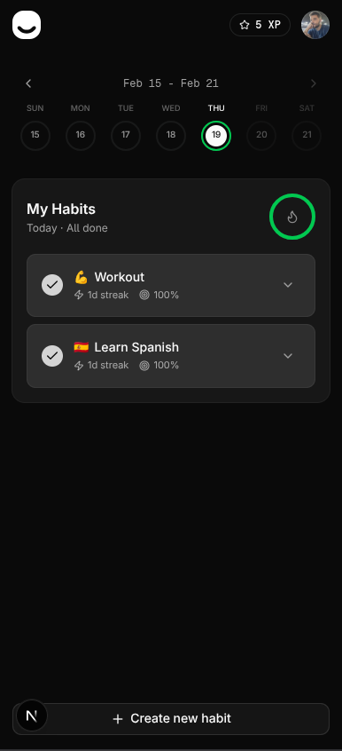
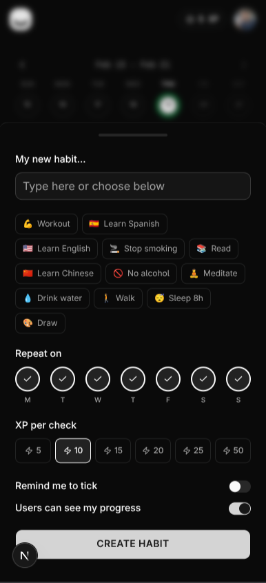
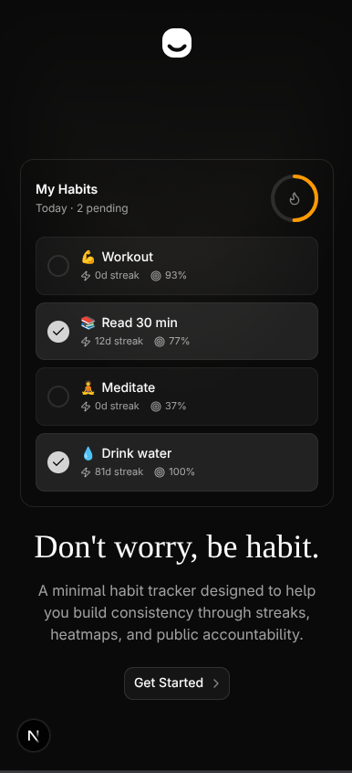

# BeHabit

A minimal habit tracker designed to help you build consistency through streaks, heatmaps, and public accountability.

<table>
  <tr>
    <td></td>
    <td></td>
    <td></td>
  </tr>
</table>

## Stack

- **Frontend** — Next.js 15, React 19, Tailwind CSS, shadcn/ui, Framer Motion
- **Backend** — Elysia (Bun), Drizzle ORM, PostgreSQL
- **Auth** — BetterAuth (email/password + GitHub/Google OAuth)
- **API** — Eden Treaty (type-safe end-to-end)

## Getting started

**Prerequisites:** Node.js 20+, Bun, Docker

```bash
# Install dependencies
pnpm install

# Start PostgreSQL
docker compose up -d

# Copy and fill in env vars
cp .env.example .env

# Run migrations
pnpm db:migrate

# Start dev server (Next.js + API)
pnpm dev
```

The app runs on [http://localhost:3000](http://localhost:3000), API on port 3001.

## Features

- Daily habit check-ins with streak tracking
- Weekly calendar strip and activity heatmap
- XP system with redeemable rewards
- Public profile page (`/@username`)
- PWA support

## License

MIT
